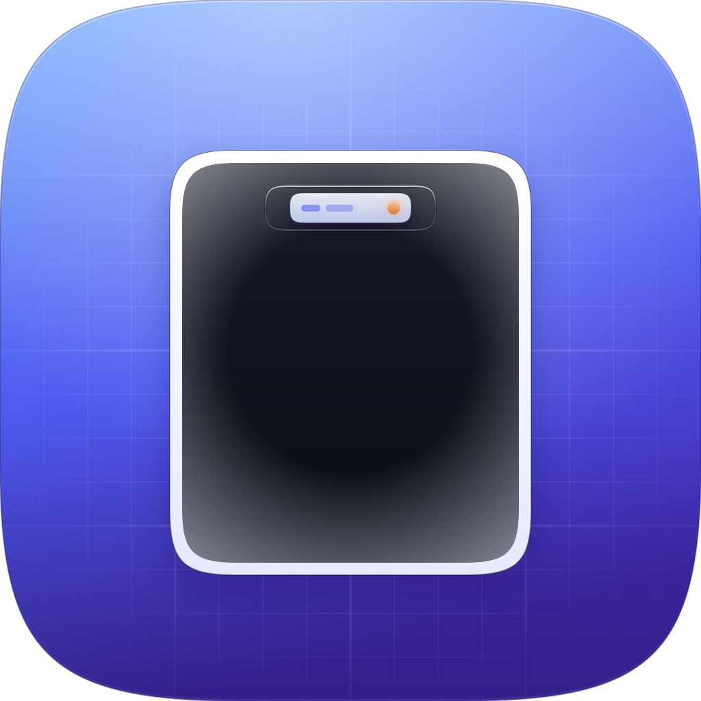

# Skerry



> A [Mobitecture](https://github.com/mohuddle) app · *apps, architected.*

A small island at the camera cutout. Live activities you chose, and nothing else.

**Skerry** is an Android Dynamic Island–style pill that does **not** use an Accessibility service. No ads. No analytics. No crash-upload SDK. v1 has no `INTERNET` permission.

Package: `io.github.mohuddle.skerry`

**Progress: 12 of 12 v1 tasks.** Board: **[TASKS.md](TASKS.md)**. Design: **[DESIGN.md](DESIGN.md)**. Privacy: **[PRIVACY.md](PRIVACY.md)**.

| Status | Task |
|---|---|
| Done | 1. Gradle scaffold (no `INTERNET`, no Accessibility) |
| Done | 2. Cutout overlay |
| Done | 3. Foreground service |
| Done | 4. Allowlist store |
| Done | 5. Allowlist picker |
| Done | 6. Notification watcher |
| Done | 7. Stack, cycle, and expand |
| Done | 8. Media play/pause |
| Done | 9. Actions and inline reply |
| Done | 10. Charging toggle |
| Done | 11. Survival Settings |
| Done | 12. Device pass (Pixel 9 Pro and a fake-cutout emulator) |

There is no Play listing yet. The debug APK is `app/build/outputs/apk/debug/app-debug.apk`.

---

## Overview

Play Store “Dynamic Island” clones usually ask for Accessibility so they can steal gestures near the camera hole, scrape other apps, and survive OEM battery killers. That grant can also read your screen.

Skerry draws a `TYPE_APPLICATION_OVERLAY` pill at `DisplayCutout`, reads **only** notifications you allowed plus `MediaSession` now-playing, and keeps itself alive with a normal foreground service. Accessibility is never declared.

You pick the apps. Spotify, a local player, Aftercast, Messages — if it posts a notification or a media session and it is on the allowlist, it can appear. If it is not on the list, Skerry never shows it.

## Key features (v1 target)

1. **Allowlist** — nothing appears unless you turn that package on.
2. **Stack** — several live items. Left icon **cycles**. Center tap **expands**.
3. **Media chrome** — if any allowlisted player is active, the **right side is always play/pause**, even when the current item is a chat.
4. **Inline reply** — only when that notification already supports `RemoteInput` and the app is allowlisted. Messages bubbles stay yours; leave Messages off the list if you prefer them.
5. **Charging** — optional system toggle, not an app.
6. **Offline and local** — no network in v1; live text stays in memory.

Not in v1: Accessibility, cutout swipe shortcuts, screenshot-via-global-action, weather, answering calls, Bluetooth earbud battery, Play Store, ads.

## How to build

1. JDK 21 and an Android SDK with platform 36.
2. Clone this repository.
3. `./gradlew assembleDebug`

Pace: one task from [TASKS.md](TASKS.md) per working session.

```
Do only Task N in TASKS.md. Follow DESIGN.md. Stop when that task’s Done when is true. Do not start the next task. No subagents.
```

Test layout on a **punch-hole** phone or an emulator with a fake cutout. The LG G5 is the wrong hardware for cutout placement.

## Technical specs

| | |
|---|---|
| Language | Kotlin |
| UI | Jetpack Compose, Material 3 |
| minSdk | 29 (Android 10) |
| Application id | `io.github.mohuddle.skerry` |
| Overlay | `SYSTEM_ALERT_WINDOW` |
| Live content | `NotificationListenerService` + `MediaSessionManager` |
| Host | Foreground service (`specialUse` / `mediaPlayback`) |
| Not used | Accessibility, `INTERNET` (v1) |

## Privacy

See [PRIVACY.md](PRIVACY.md). Data safety goal for a later Play listing: nothing collected or shared.

## Security

Sideload in v1. Overlay and notification access are user grants with Settings CTAs. They fail closed: if revoked, the pill hides. No Accessibility declaration, so Advanced Protection and Play’s accessibility review do not apply.

## License

MIT. See [LICENSE](LICENSE).

---
Made by [Mobitecture](https://github.com/mohuddle) · apps, architected.
